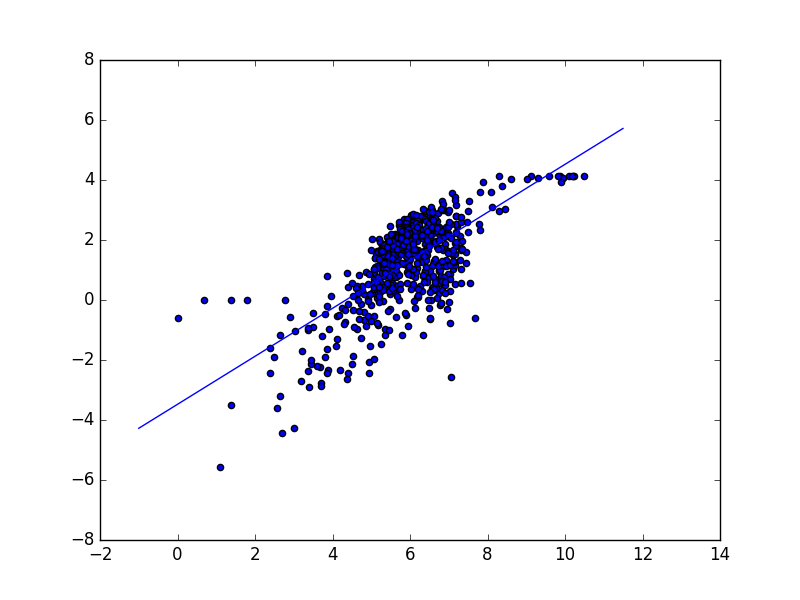
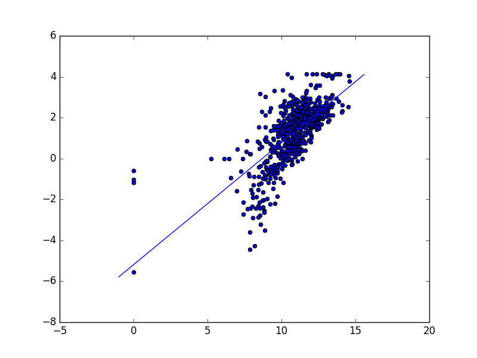

# Population_nightlight

Finding correlation between Sum of nightlight intensities and socio-economic paremeters.

In the following paper, they tried to find correlation between GDP, nightlight and several census variables.
In this analysis, we try to study the correlation between  Mean nightlight of a district with various socio-
economic parameters.
We take log of Mean of nightlights and census variables as the dataset is left skewed. Then a linear regression model is built
to fit the datset.

Results:

R2 values for Log-Linear regression between Mean nightlight and census variables

1. Population density           0.477
2. Urban household              0.488
3. Literacy rate                0.23
4. Population                   0.29
5. Number of household          0.32
6. Number of towns              0.28
7. 'Number of villages Inhabited', 'Number of towns', 'Number of households', 'Population Persons', '"Area(In sq. km)"', 'Population per sq. km.', 'Marginal Worker/Non-workers', 'Literacy rate', 'Urban/Rural Household'            0.67

Population density regression plot:

Positive outliers:

'Ganderbal', 'Lakshadweep', 'East Kameng', 'Lower Dibang Valley', 'Lahul & Spiti', 'Bandipore', 'Kishtwar', 'Jamui', 'Tuensang', 'Mon'

Negative outliers:

'Bangalore Rural', 'Jamnagar', 'Bathinda', 'Sirsa', 'Muktsar', 'Bharuch', 'Upper Siang', 'Anjaw', ' ', 'Dibang Valley'
  

Urban household regression plot:

Negative outliers:

'Central', 'Karaikal', 'Daman', 'Yanam', 'Mahe', 'New Delhi', 'Diu', 'Kinnaur', 'Nicobars'

Positive outliers:

'East Kameng', 'Lower Dibang Valley', 'Leh(Ladakh)', 'West Siang', 'Upper Subansiri', 'Lunglei', 'Tuensang', 'Saiha', 'Ukhrul', 'Ganderbal'

References:
1. [Night  Lights  and  Economic  Activity  in  India:  A  study  using  DMSP-OLS  night  time  images  by Laveesh  Bhandari  and  Koel  Roychowdhury  ](http://journals.sfu.ca/apan/index.php/apan/article/viewFile/59/71)
